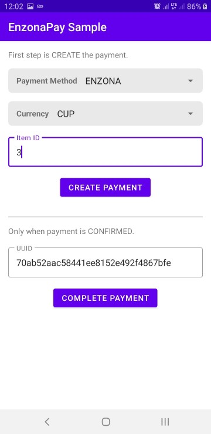
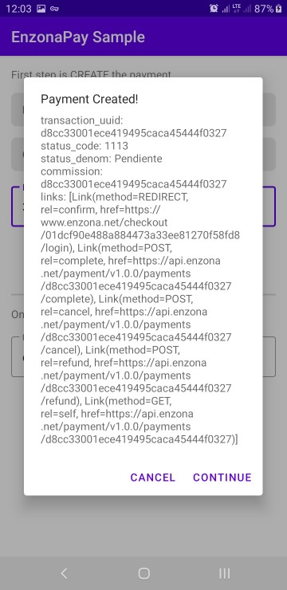

💰 EnzonaPay
=======
Android implementation of Enzona XETID-DT-VC. Restricted and specific use case.

**WARNING: Confirm Payment step use a real balance.**

[](https://jitpack.io/#jdsdhp/enzonapay) 
[](https://android-arsenal.com/api?level=17) 
[](https://opensource.org/licenses/Apache-2.0)
[](https://twitter.com/jdsdhp)

## Screenshots
Sample library project to test the payment platform.

Create Payment | Authenticate with Enzona | Confirm Payment
:-:|:-:|:-:
 |  | 

## Including in your project

#### Gradle

```gradle
allprojects  {
    repositories {
        ...
        maven { url 'https://jitpack.io' }
    }
}
```
Add the dependency.
```gradle
dependencies {
    implementation 'com.github.jdsdhp:enzonapay:$version'
}
```
## Usage

### Kotlin
After successfully creating the payment, a `PayCreateResponse` is received and the payment needs to be confirmed. For this, `PayWebViewFragment` is used passing as a parameter the response of the payment created.. This fragment  is usually added through a transition.

```kotlin
supportFragmentManager.beginTransaction()
    .setTransition(FragmentTransaction.TRANSIT_FRAGMENT_FADE) //Optional
    .replace(R.id.container, PayWebViewFragment.newInstance(payCreateResponse))
    .commit()
```

Use `WebViewLoadListener` to listen for status changes and errors that may arise.
```kotlin
supportFragmentManager.addFragmentOnAttachListener { _, fragment ->
    if (fragment is PayWebViewFragment) {
        fragment.webViewLoadListener = object : WebViewLoadListener {
            override fun onLoading(createResponse: PayCreateResponse) {
                //Write you logic here.
            }

            override fun onLoadFinish(createResponse: PayCreateResponse) {
                //Write you logic here.
            }

            override fun onError(
                createResponse: PayCreateResponse,
                code: Int?,
                message: String?,
            ) {
                //Write you logic here.
            }

            override fun onPaymentCanceled(createResponse: PayCreateResponse) {
                //Write you logic here.
            }

            override fun onPaymentConfirmed(createResponse: PayCreateResponse) {
                //Write you logic here.
            }
        }
    }
}
```

License
=======

    Copyright (c) 2021 jesusd0897.
    
    Licensed under the Apache License, Version 2.0 (the "License");
    you may not use this file except in compliance with the License.
    You may obtain a copy of the License at
    
        http://www.apache.org/licenses/LICENSE-2.0
    
    Unless required by applicable law or agreed to in writing, software
    distributed under the License is distributed on an "AS IS" BASIS,
    WITHOUT WARRANTIES OR CONDITIONS OF ANY KIND, either express or implied.
    See the License for the specific language governing permissions and
    limitations under the License.
